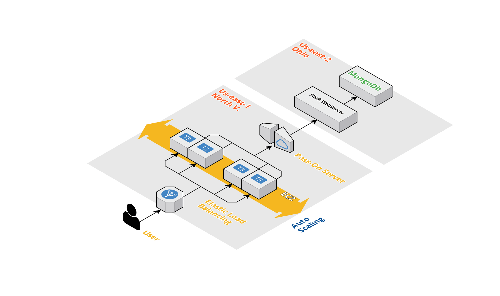

# Cloud Infrastructure AWS  

## Introduction  
---
This project main goal is to create an automated way to get a full webserver running in just one command. The application uses Amazon Web Services to host all the dependencies and avail some of the features provided by AWS to make a more secure and stable webserver. The framework utilized for developing the application is a Flask backend with the possibility of making simple requests and the database is stored in a MongoDB server. This project prioritizes more the infrastructure of a stable, reliable and scalable server than a complex web application. The development of the project rely on the library boto of AWS to translate all the code to AWS commands.

## Model

  

This model shows the topology of the project and it is important to highlight that the Flask webserver and the database server are hosted in instances (EC2) of aws in Ohio and the Pass-On, Auto Scaling and Load Balancer server are hosted in instances in North Virginia, following good pratices of security. The Pass-On server just redirects for the webserver while the Auto Scaling group creates new instances following the demand of the application. The Load Balancer conduct the user for instances that are less overloaded.

## How To Use  
Install the dependencies:  

```  
$ pip3 install boto3  
$ pip3 install awscli --upgrade --user  
```  
Configure AWS Credentials:  
```
$ aws configure
```
Run:  
```
$ python app.py  
```

## Notes  
To fully work you will need to change some of credential infos in code like keys and ips.  
This project work with other github repository in order to install the scripts that are necessary for the instance: https://github.com/hugoecarl/PF_Cloud  
